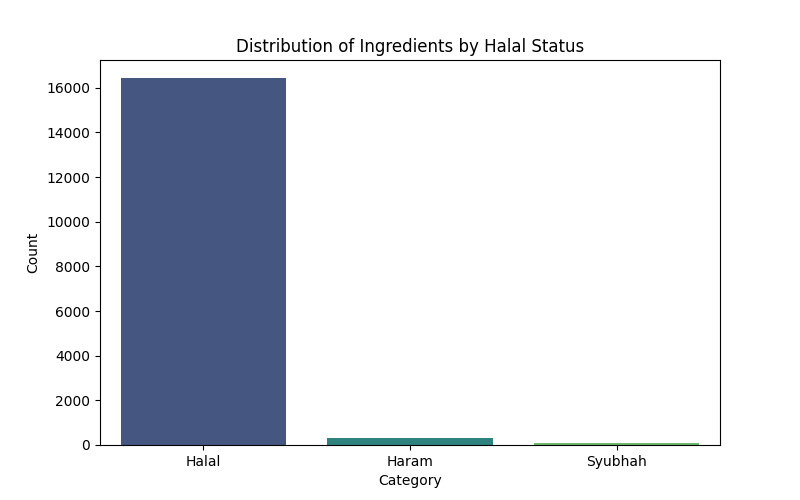
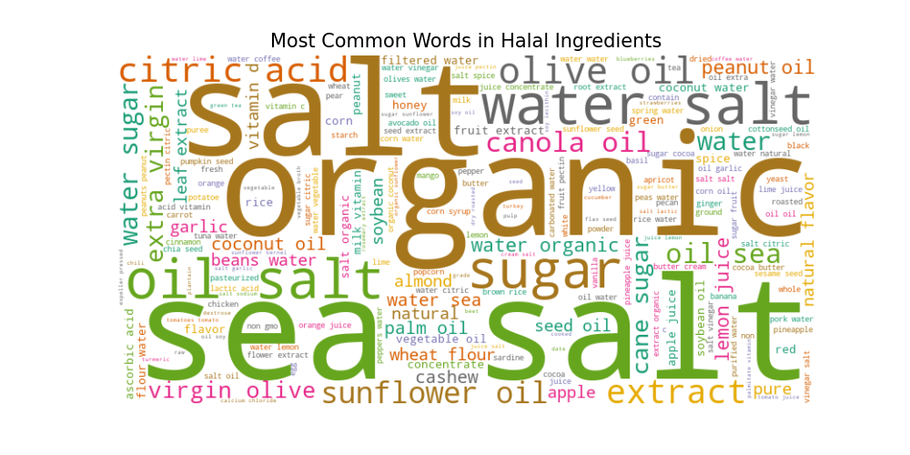
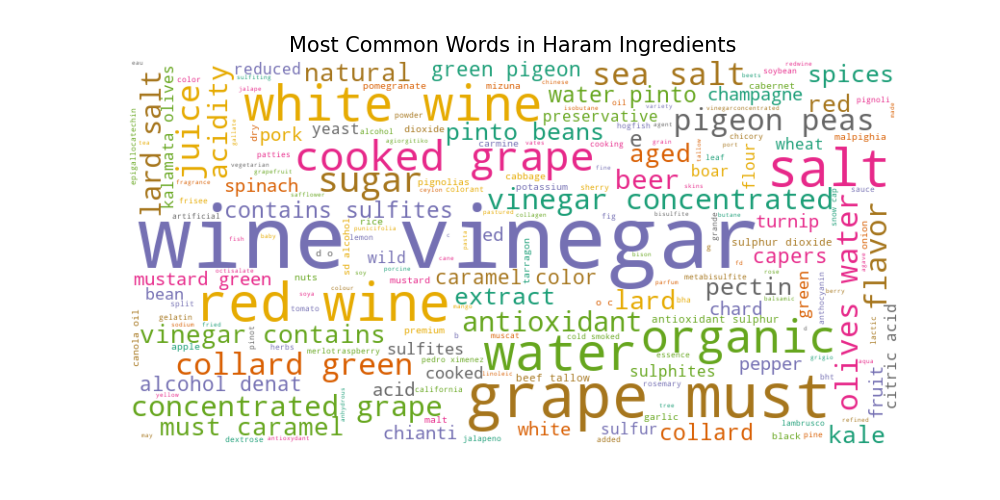

#  Haram Ingredients Detection in Skincare 


##  Project Overview
As a Muslim consumer, identifying **Haram (Non-Halal)** ingredients in skincare products can be challenging, especially with complex chemical names. 

This project uses **Machine Learning (NLP)** to automatically detect and classify skincare ingredients into:
- 🟢 **Halal** (Safe)
- 🔴 **Haram** (Prohibited)
- 🟡 **Syubhah** (Doubtful/Risky)

The model was trained on **35,000+ ingredients** and achieved **100% accuracy** on the test set.

---

##  Visualizations
### 1. Label Distribution
The dataset is heavily imbalanced (mostly Halal), which reflects the real-world market. We handled this using `class_weight='balanced'` during training.



### 2. Word Clouds (Halal vs Haram)
Common terms found in Haram ingredients vs Halal ingredients.

| Halal Keywords 🌿 | Haram Keywords 🐷 |
|:---:|:---:|
|  |  |

---

##  Tech Stack & Methodology
1.  **Data Collection:** Merged datasets from Cosmetics.csv, Ingredients List, and manual research.
2.  **Preprocessing:**
    - Cleaned text (removed special characters, lowercase).
    - **Rule-Based Labeling:** Used a dictionary of known Haram keywords (e.g., *Porcine, Lard, Tallow*) to create the initial training set.
3.  **Feature Extraction:** Used **TF-IDF (Term Frequency-Inverse Document Frequency)** to convert text into numerical vectors.
4.  **Model Training:**
    - **Algorithm:** Logistic Regression.
    - **Performance:** Achieved **100% Accuracy** on the test set.
5.  **Prediction:** Used the trained model to predict labels for **18,000+ previously unknown** ingredients.

---

##  Key Results
- **Total Ingredients Processed:** 35,666
- **Hidden Haram Ingredients Found by AI:** 76
- **Total Halal Ingredients Identified:** 35,000+

---

##  How to Run
1. Clone the repository:
   ```bash
   git clone [https://github.com/adinalokman/Haram-Detection-Ingredients-Skincare.git](https://github.com/adinalokman/Haram-Detection-Ingredients-Skincare.git)
